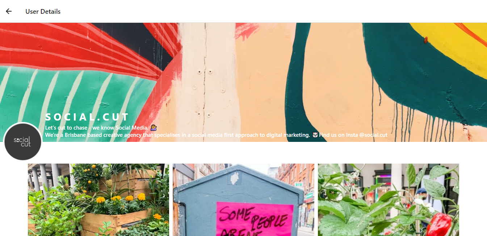
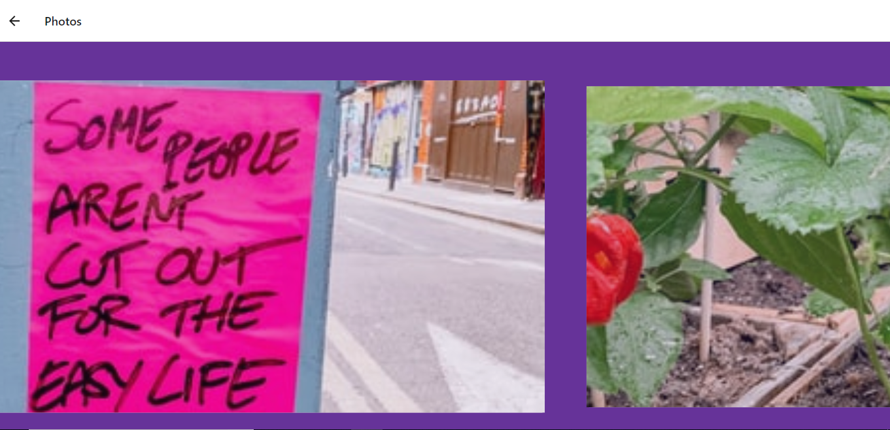

# react_user_profile
User Profile pages for android/ios/web using react-native

<h1>Screen shots from mobile app</h1>

<h1>Screen shots from web app</h1>

<h1>Usage</h1>
<h2>To install all the packages run 'npm i'</h2>
<h2>To run web app 'npm run web'</h2>
<h2>To run on android use 'npm run android'</h2>
<h2>To run ios use 'npm run ios'</h2>
